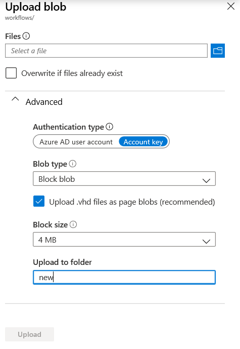
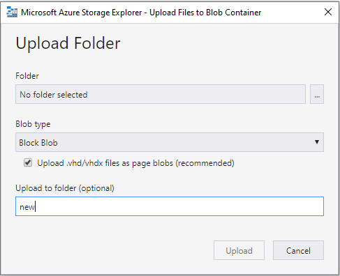

# Managing your workflow
[Prepare](#Prepare-your-workflow) your workflow <br/>
[Start](#Start-your-workflow) your workflow <br/>
[Get your workflow Id](#Get-the-Cromwell-workflow-ID) for your workflow <br/>
[Abort](#Abort-your-workflow) an in-progress workflow <br/>

## Prepare your workflow

### How to prepare a Workflow Description Language (WDL) file that runs a workflow on Cromwell on Azure

For any pipeline, you can create a [WDL](https://software.broadinstitute.org/wdl/) file that calls your tools in Docker containers. Please note that Cromwell on Azure only supports tasks with Docker containers defined for security reasons.<br/>

In order to run a WDL file, you must modify/create a workflow with the following runtime attributes for the tasks that are compliant with the [TES or Task Execution Schemas](https://cromwell.readthedocs.io/en/develop/backends/TES/):

```
runtime {
    cpu: 1
    memory: "2 GB"
    disk: "10 GB"
    docker:
    maxRetries: 0
    preemptible: true
}
```
Ensure that the attributes `memory` and `disk` (note: use the singular form for `disk` NOT `disks`) have units. Supported units from Cromwell:

> KB - "KB", "K", "KiB", "Ki"<br/>
> MB - "MB", "M", "MiB", "Mi"<br/>
> GB - "GB", "G", "GiB", "Gi"<br/>
> TB - "TB", "T", "TiB", "Ti"<br/>

The `preemptible` attribute is a boolean. You can specify `preemptible` as `true` or `false` for each task. When set to `true` Cromwell on Azure will use a [low-priority batch VM](https://docs.microsoft.com/en-us/azure/batch/batch-low-pri-vms#use-cases-for-low-priority-vms) to run the task. If set to `false` Cromwell on Azure will use a [dedicated VM](https://docs.microsoft.com/en-us/azure/batch/nodes-and-pools#node-type-and-target) to run the task.<br/>

Starting with Cromwell on Azure version 3.2 integer values for `preemptible` are accepted and will be converted to boolean: `true` for positive values, `false` otherwise.<br/>

`bootDiskSizeGb` and `zones` attributes are not supported by the TES backend.<br/>
Each of these runtime attributes are specific to your workflow and tasks within those workflows. The default values for resource requirements are as set above.<br/>
Learn more about Cromwell's runtime attributes [here](https://cromwell.readthedocs.io/en/develop/RuntimeAttributes).

### Configure your Cromwell on Azure workflow files

#### Trigger JSON file
To run a workflow using Cromwell on Azure, you will need to specify the location of your WDL or CWL file and inputs JSON file in an Cromwell on Azure-specific trigger JSON file which also includes any workflow options and dependencies. Submitting this trigger file initiates the Cromwell workflow.

All trigger JSON files include the following information:
- The "WorkflowUrl" is the url for your WDL or CWL file.
- The "WorkflowInputsUrl" is the url for your input JSON file. You can use this file to customize inputs to any workflow file.
- The "WorkflowOptionsUrl" is only used with some workflow files. If you are not using it set this to `null`.
- The "WorkflowDependenciesUrl" is only used with some workflow files. If you are not using it set this to `null`.

Your trigger file should be configured as follows:
```
{
 "WorkflowUrl": <URL path to your WDL file in quotes>,
 "WorkflowInputsUrl": <URL path to your input json file in quotes>,
 "WorkflowOptionsUrl": <URL path to your workflow options json in quotes>,
 "WorkflowDependenciesUrl": <URL path to your workflow dependencies file in quotes>
}
```

By default, Cromwell on Azure mounts a storage account to your instance, which is found in your resource group after a successful deployment. You can [follow these steps](/docs/troubleshooting-guide.md/#Use-input-data-files-from-an-existing-Storage-account-that-my-lab-or-team-is-currently-using) to mount a different storage account that you manage or own, to your Cromwell on Azure instance.<br/>

#### Specify file locations
There are four main ways to specify the blob paths within your trigger JSON, "WorkflowUrl" WDL or CWL file, "WorkflowInputsUrl" JSON file, and "WorkflowDependenciesUrl" file. The "WorkflowOptionsUrl" file only supports the first format.<br/>

If using the default storage account or using a storage account connected to your Cromwell on Azure instance:
1. For blobs/files hosted on an Azure Storage account that is connected to your Cromwell on Azure instance, the input path consists of 3 parts - the storage account name, the blob container name, blob/file path with extension, following this format:
```
/<storageaccountname>/<containername>/<blobName>
```
Example file path for an "inputs" container in a storage account "msgenpublicdata" will look like
`"/msgenpublicdata/inputs/chr21.read1.fq.gz"`

This is the **only supported format for blob paths within the "WorkflowOptionsUrl" file**.

2. You can also use the https URLs which can be found by clicking on the blob to view the properties from the Azure portal. The URL path to "WorkflowUrl" for a test WDL file in a container called "inputs" will look like:
```
https://<storageaccountname>.blob.core.windows.net/inputs/test/test.wdl
```

If using files in locations that are not connected to your Cromwell on Azure instance:<br/>
3. Via [SAS URLs](https://docs.microsoft.com/en-us/azure/storage/common/storage-sas-overview) for Azure Storage account blobs/files that are not connected to your Cromwell on Azure instance<br/>
4. Via public http or https URLs like GitHub raw URLs

#### Ensure your dependencies are accessible by Cromwell
Any additional scripts or subworkflows must be accessible to TES. Apart from the [above methods](#Specify-file-locations), the "WorkflowDependenciesUrl" property can also be defined via a ZIP file in a storage container accessible by Cromwell.

## Start your workflow

To start a WDL workflow, go to your Cromwell on Azure Storage account associated with your host VM. In the `workflows` container, place the trigger JSON file in the "new" virtual directory (note: virtual directories do not exist on their own, they are just part of a blob's name). This initiates a Cromwell workflow, and returns a workflow ID that is appended to the trigger JSON file name and transferred to the "inprogress" directory in the `workflows` container.<br/>

This can be done programmatically using the [Azure Storage SDKs](https://azure.microsoft.com/en-us/downloads/), or manually via the [Azure Portal](https://portal.azure.com) or [Azure Storage Explorer](https://azure.microsoft.com/en-us/features/storage-explorer/).

### Via the Azure Portal
<br/>

### Via Azure Storage Explorer


For example, a trigger JSON file with name `task1.json` in the "new" directory, will be move to the "inprogress" directory with a modified name `task1.uuid.json`. This uuid is a workflow ID assigned by Cromwell.<br/>

Once your workflow completes, you can view the output files of your workflow in the `cromwell-executions` container within your Azure Storage Account. Additional output files from the Cromwell endpoint, including metadata and the timing file, are found in the `outputs` container. To learn more about Cromwell's metadata and timing information, visit the [Cromwell documentation](https://cromwell.readthedocs.io/en/stable/).<br/>

## Get the Cromwell workflow ID

The Cromwell workflow ID is generated by Cromwell once the workflow is in progress, and it is appended to the trigger JSON file name.<br/>

For example, placing a trigger JSON file with name `task1.json` in the "new" directory will initiate the workflow.  Once the workflow begins, the JSON file will be moved to the "inprogress" directory in the "workflows" container with a modified name `task1.guid.json`


## Abort your workflow
To abort a workflow that is in-progress, go to your Cromwell on Azure Storage account associated with your host VM. In the `workflows` container, place an empty file in the "abort" virtual directory named `cromwellID.json`, where "cromwellID" is the Cromwell workflow ID you wish to abort.
