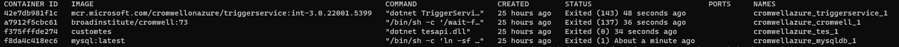
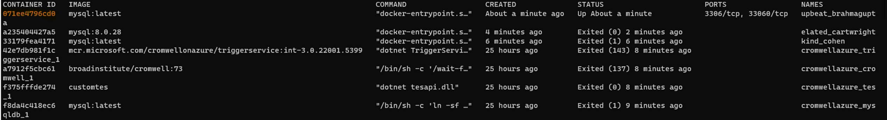

# MySQL update for Cromwell on Azure 

## To update MySQL you need to complete the following steps: 

- Stop CromwellOnAzure while leaving the VM up and running 

- Start MySQL container using the previous version, let it process the logs and shut it down 

- Start latest MySQL container, let it process the update and shut it down 

- Start CoA 

## The detailed instructions are provided below: 

1. Connect to Cromwell on Azure VM via SSH. Default CoA deployment creates Network security group with SSH port closed. To connect to a VM follow instructions [Connect to a Linux VM](https://docs.microsoft.com/en-us/azure/virtual-machines/linux-vm-connect?tabs=Linux).

2. Have 2 terminals with SSH connection open. 

3. In terminal 1 

 - Stop Cromwell on Azure  

     ```sudo systemctl stop cromwellazure```

- List docker containers

    ```sudo docker container ls -a ```



- `mysql:latest` will be listed there, start it 

    ```sudo docker run -e MYSQL_ROOT_PASSWORD=<Your MySQL root password> -e MYSQL_DATABASE=<Your MySQL database name> -v /data/mysql:/var/lib/mysql -v /data/cromwellazure/mysql-init:/mysql-init mysql:latest ```

    You can find values for `MYSQL_ROOT_PASSWORD` and `MYSQL_DATABASE` in Blob container `configuration` that is located in the deployed Storage account. Open file `cromwell-application.conf` and search for database section
     ```
    database {
        db.url = "jdbc:mysql://mysqldb/<Your MySQL database name>?<Properties>"
        db.user = <Your MySQL root user>
        db.password = <Your MySQL root password>
        ...
    }
    ```


 - It is supposed to fail. If it keeps running, follow instructions in step 6 to stop the container, and return to terminal 1 

 

 - Find MySQL version that was used to create the log (see above in red), start this version, and let it process the log 

    ```sudo docker run -e MYSQL_ROOT_PASSWORD=<Your MySQL root password> -e MYSQL_DATABASE=<Your MySQL database name> -v /data/mysql:/var/lib/mysql -v /data/cromwellazure/mysql-init:/mysql-init mysql:8.0.28 ```

4. Switch to terminal 2 

- List docker containers and find CONTAINER ID for MySQL version you just started  

    ```sudo docker container ls -a``` 


- Stop this container 

    ```sudo docker container stop a235404427a5```

5. Switch to terminal 1

- Check that MySQL shutdown complete 

- Start the latest MySQL image and let it process the update 

    ```sudo docker run -e MYSQL_ROOT_PASSWORD=<Your MySQL root password> -e MYSQL_DATABASE=<Your MySQL database name> -v /data/mysql:/var/lib/mysql -v /data/cromwellazure/mysql-init:/mysql-init mysql:latest``` 

6. Switch to terminal 2 

- List docker containers and find CONTAINER ID for latest MySQL you just started  

    ```sudo docker container ls -a```  



- Stop this container

    ```sudo docker container stop 071ee4796cd0```

7. Switch to terminal 1

- Check that MySQL shutdown complete
- Start Cromwell on Azure

    ```sudo systemctl start cromwellazure```

8. Go to Network security group and close SSH port.
